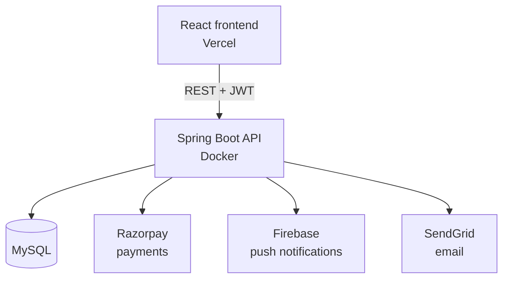

# Telangana Special — Backend

REST API for **Telangana Special**, an online store for traditional Telangana snacks and sweets (bobbatlu, sarvapindi, and more). Built with Spring Boot, it handles authentication, catalog management, cart, orders, payments, and notifications for the [React frontend](https://github.com/laharithallapally/telangana-special-frontend).

**Live API:** _add your deployed URL here, e.g. `https://telangana-special-api.onrender.com`_
**Swagger docs:** `<base-url>/swagger-ui.html`

## Tech stack

- **Java 21** + **Spring Boot 3** (Web, Data JPA, Security, Validation)
- **MySQL** for persistence
- **JWT** for stateless authentication
- **Razorpay** for payments
- **Firebase Admin SDK** for push notifications
- **SendGrid** for transactional email (password reset)
- **springdoc-openapi** for Swagger/OpenAPI docs
- **Docker** for containerized deployment

## Architecture



## Features

- JWT-based registration/login with role support (`USER`, `ADMIN`)
- Forgot / reset password via emailed token
- Product catalog with category filtering, stock, and veg/non-veg flag
- Cart (add, update quantity, remove, clear)
- Wishlist
- Saved addresses with a default address
- Order placement from cart, order history, admin order status updates
- Razorpay order creation + payment signature verification
- Push notifications (FCM) and an in-app notification feed
- Swagger/OpenAPI documentation with bearer-token auth baked in
- Global exception handling with consistent error responses

## API reference

All endpoints are prefixed with `/api`. Endpoints marked 🔒 require a JWT bearer token; 🔒👑 require the `ADMIN` role.

| Area | Method & path | Description |
|---|---|---|
| Auth | `POST /auth/register` | Create an account, returns a JWT |
| Auth | `POST /auth/login` | Authenticate, returns a JWT |
| Auth | `POST /auth/forgot-password` | Email a password reset link |
| Auth | `POST /auth/reset-password` | Reset password with a valid token |
| Users | 🔒 `GET /users/me` | Get current user profile |
| Users | 🔒 `PUT /users/me` | Update name/phone |
| Users | 🔒 `POST /users/fcm-token` | Register a device for push notifications |
| Products | `GET /products` | List products |
| Products | `GET /products/{id}` | Get a product |
| Products | `GET /products/category/{category}` | Filter by category |
| Products | 🔒👑 `POST /products` | Create a product |
| Products | 🔒👑 `PUT /products/{id}` | Update a product |
| Products | 🔒👑 `DELETE /products/{id}` | Delete a product |
| Cart | 🔒 `GET /cart` | View cart |
| Cart | 🔒 `POST /cart` | Add item |
| Cart | 🔒 `PUT /cart/{cartItemId}` | Update quantity |
| Cart | 🔒 `DELETE /cart/{cartItemId}` | Remove item |
| Cart | 🔒 `DELETE /cart` | Clear cart |
| Wishlist | 🔒 `GET /wishlist` | View wishlist |
| Wishlist | 🔒 `POST /wishlist/{productId}` | Add product |
| Wishlist | 🔒 `DELETE /wishlist/{productId}` | Remove product |
| Addresses | 🔒 `GET /addresses` | List saved addresses |
| Addresses | 🔒 `POST /addresses` | Add address |
| Addresses | 🔒 `PUT /addresses/{addressId}` | Update address |
| Addresses | 🔒 `DELETE /addresses/{addressId}` | Delete address |
| Addresses | 🔒 `PUT /addresses/{addressId}/default` | Set as default |
| Orders | 🔒 `POST /orders` | Place order from cart |
| Orders | 🔒 `GET /orders` | List my orders |
| Orders | 🔒 `GET /orders/{orderId}` | Get order details |
| Orders | 🔒👑 `PUT /orders/{orderId}/status` | Update order status |
| Orders | 🔒👑 `GET /orders/admin/all` | List all orders |
| Payment | 🔒 `POST /payment/create-order` | Create a Razorpay order |
| Payment | 🔒 `POST /payment/verify` | Verify a Razorpay payment signature |
| Notifications | 🔒 `GET /notifications` | List notifications |
| Notifications | 🔒 `GET /notifications/unread-count` | Unread count |
| Notifications | 🔒 `PUT /notifications/mark-read` | Mark as read |

Full interactive docs are available via Swagger UI once the server is running.

## Getting started

### Prerequisites

- Java 21
- Maven (or use the included `./mvnw` wrapper)
- MySQL 8+
- A Razorpay test account (for payments)
- A Firebase project with a service account key (for push notifications) — optional for local dev
- A SendGrid API key (for password reset emails) — optional for local dev

### Setup

1. Clone the repo and copy the example config:
   ```bash
   git clone https://github.com/laharithallapally/telangana-special-backend.git
   cd telangana-special-backend
   cp src/main/resources/application.properties.example src/main/resources/application.properties
   ```
2. Fill in `application.properties` with your own MySQL credentials, JWT secret (`openssl rand -base64 32`), Razorpay test keys, and SendGrid key. **Never commit this file** — it's already in `.gitignore`.
3. If using Firebase push notifications, download your service account JSON and place it where `FirebaseConfig` expects it, then set `firebase.config.path` accordingly.
4. Run it:
   ```bash
   ./mvnw spring-boot:run
   ```
   The API starts on `http://localhost:8080`. Swagger UI is at `http://localhost:8080/swagger-ui.html`.

### Running with Docker

```bash
docker build -t telangana-special-backend .
docker run -p 8080:8080 --env-file .env telangana-special-backend
```

### Running tests

```bash
./mvnw test
```

## Project structure

```
src/main/java/com/telanaganaspecial/
├── config/        # Security, Swagger, Firebase, seed data
├── controller/     # REST endpoints
├── dto/            # Request/response payloads
├── entity/         # JPA entities
├── exception/      # Custom exceptions + global handler
├── mapper/         # Entity <-> DTO mapping
├── repository/     # Spring Data JPA repositories
├── security/       # JWT filter + utilities
└── service/        # Business logic
```

## Roadmap / known gaps

- No refresh-token flow (JWT is long-lived, 24h) — fine for a demo, worth revisiting for production
- No rate limiting on public endpoints (auth, product listing)
- No automated tests beyond the Spring context load test
- No CI pipeline yet (GitHub Actions build/test on push)
- Product images are referenced by URL/path rather than uploaded through an admin flow

## License

Not yet specified — add a `LICENSE` file if you intend to open-source this.
